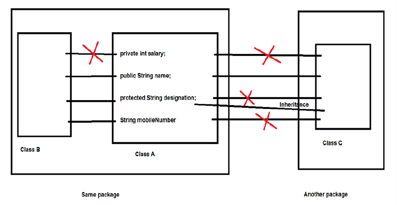
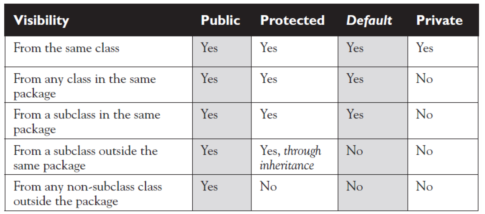
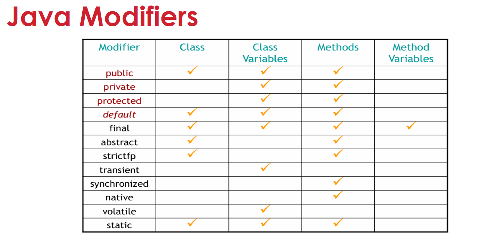

# Access Modifiers in Java

Java provides four types of **access modifiers** that determine the visibility of classes, methods, and variables.

| Modifier      | Within Class | Within Package | Subclass (Different Package) | Outside Package |
|--------------|-------------|----------------|-------------------------------|-----------------|
| **private**  | ✅ Yes       | ❌ No          | ❌ No                         | ❌ No           |
| **default**  | ✅ Yes       | ✅ Yes         | ❌ No                         | ❌ No           |
| **protected**| ✅ Yes       | ✅ Yes         | ✅ Yes                         | ❌ No           |
| **public**   | ✅ Yes       | ✅ Yes         | ✅ Yes                         | ✅ Yes          |

<details>
  <summary>1. `private` (Most Restricted)</summary>

- **Scope:** Accessible **only within the same class**.
- **Use Case:** Used for encapsulation to prevent access from outside.

```java
class Example {
    private int secret = 42;  // Accessible only inside Example class
    
    private void display() {
        System.out.println("This is private");
    }
}
```
### **Edge Cases:**
- **Private methods are not inherited**. They cannot be overridden.
- **Inner classes can access private members** of the outer class.
- **Reflection API can access private members** (can be risky in security-sensitive applications).

</details>

<details>
  <summary>2. `default` (Package-Private)</summary>

- **Scope:** Accessible **within the same package**.
- **Use Case:** Useful when related classes need access but should not be exposed outside the package.

```java
class Example {
    int packageVariable = 10;  // default access modifier
    
    void show() {  // default method
        System.out.println("Package-private method");
    }
}
```
### **Edge Cases:**
- Cannot be accessed **outside the package**, even if subclassed.
- Used heavily in package-scoped APIs, e.g., **Java Collections framework**.

</details>

<details>
  <summary>3. `protected` (Package + Subclass)</summary>

- **Scope:** Accessible **within the same package** AND in **subclasses** (even in different packages).
- **Use Case:** Used when subclasses need access to certain methods but should be hidden from general use.

```java
class Parent {
    protected void greet() {
        System.out.println("Hello from Parent");
    }
}

class Child extends Parent {
    void callGreet() {
        greet();  // Allowed due to protected access
    }
}
```
### **Edge Cases:**
- A **protected method cannot be accessed by a non-subclass in a different package**.
- A **subclass in a different package must use inheritance** to access the protected member.
- **Protected members are still accessible within the same package**, just like default.

</details>

<details>
  <summary>4. `public` (Least Restricted)</summary>

- **Scope:** Accessible **from anywhere**.
- **Use Case:** Used for APIs, utility methods, and services that need global accessibility.

```java
public class Example {
    public int number = 5;

    public void show() {
        System.out.println("Accessible everywhere!");
    }
}
```
### **Edge Cases:**
- **Public variables in classes break encapsulation**. Use getters/setters instead.
- Public methods can be accessed **even from outside the project** if the class is part of a library.
- If a **public class** is in a different package, it must be **imported** to be used.

</details>

### **Additional Considerations**
1. **Access Modifiers for Classes:**
   - **Top-Level Classes:** Only `public` and `default` are allowed.
   - **Inner Classes:** Can have `private`, `protected`, `default`, or `public`.

2. **Final + Access Modifiers:**
   - `private final` → Cannot be changed or overridden.
   - `protected final` → Can be accessed by subclasses but cannot be overridden.

3. **Abstract + Access Modifiers:**
   - `protected abstract` → Must be implemented by subclasses but not accessible elsewhere.

4. **Interfaces & Access Modifiers:**
   - All interface methods are **implicitly `public abstract`**.
   - All variables in an interface are **implicitly `public static final`**.

### **Summary**
| Modifier | Used with Class? | Used with Methods? | Used with Variables? | Visibility |
|----------|----------------|--------------------|--------------------|------------|
| **private** | ❌ No | ✅ Yes | ✅ Yes | Same class only |
| **default** | ✅ Yes | ✅ Yes | ✅ Yes | Same package |
| **protected** | ❌ No (only inner classes) | ✅ Yes | ✅ Yes | Package + Subclass (Different Package) |
| **public** | ✅ Yes | ✅ Yes | ✅ Yes | Everywhere |



